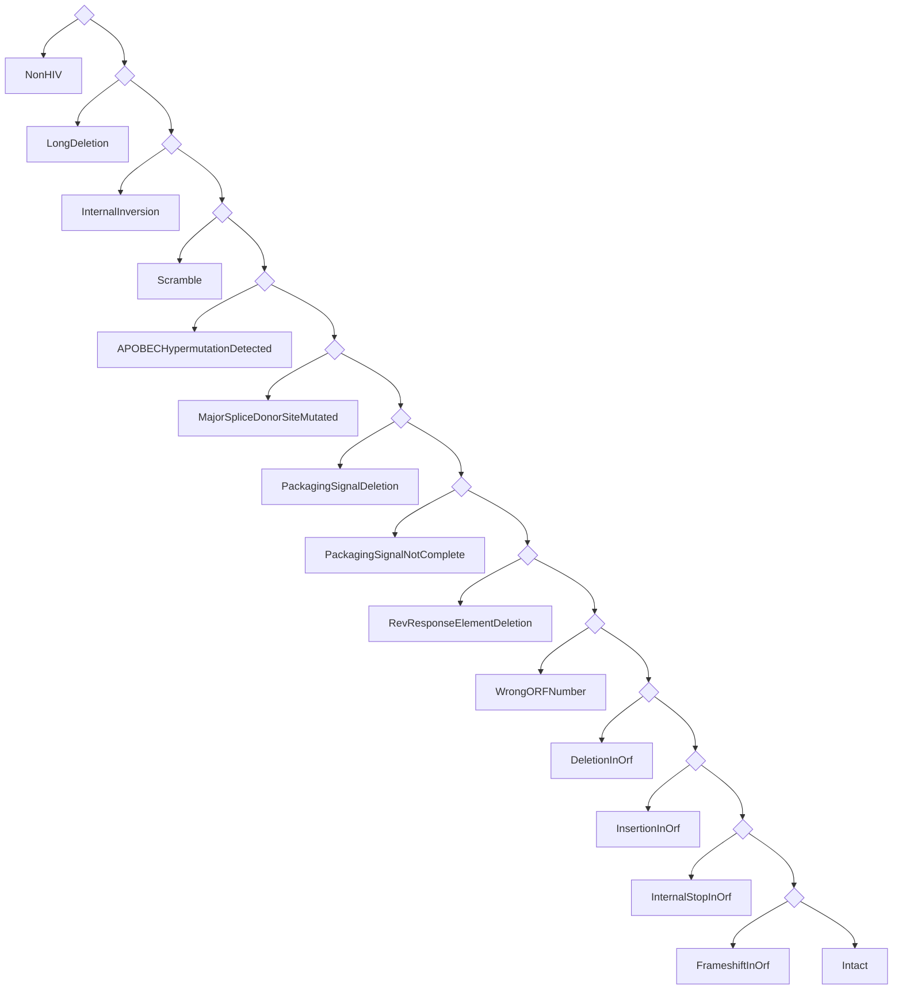

File slides.md:
```
---
# You can also start simply with 'default'
theme: seriph
# random image from a curated Unsplash collection by Anthony
# like them? see https://unsplash.com/collections/94734566/slidev
background: https://cover.sli.dev
title: Proviral pipeline
# some information about your slides (markdown enabled)
info: |
  ## Proviral pipeline
  Presentation for BC CfE
class: text-center
# https://sli.dev/features/drawing
drawings:
  persist: true
# slide transition: https://sli.dev/guide/animations.html#slide-transitions
transition: fade
# enable MDC Syntax: https://sli.dev/features/mdc
mdc: true
zoom: 1.5
hideInToc: true
---

# Proviral pipeline

A gentle introduction

<!-- TODO: improve the subtitle -->

---
transition: fade-out
hideInToc: true
---

# About me

- **Programmer for the lab**
  - Focusing on MiCall and Proviral pipelines

- **Programming Enthusiast**
  - Blogger at https://vau.place
  - Contributor to free software projects
  - Specialize in programming languages

<!--

- My name is Vitalik, I am a software developer here, working mostly on MiCall and Proviral right now.

- I have a passion for programming, lots of hobby projects, and a programming blog.

- As a Ukrainian, I am grateful for the support that many of you have shown for my country. The war is still ongoing, and it's only getting worse.

-->

---
hideInToc: true
zoom: 1.2
---

# Presentation plan

<Toc columns=2 />

---

# What is Proviral Pipeline?

- Collection of programs that output images and CSV files.
- Is a pipeline. <!-- What this means is that it's a series of steps basically. -->
- Written by Don, Charlotte, and me <!-- I want to highlight the programmers' efforts. -->

<!--

- The Proviral Pipeline is essentially an suite of applications that automates the transformation of sequence data into analytical outputs such as images and CSV files.
- It is structured as a pipeline, which means it processes data through a sequential series of steps, and outputs of each step are fed into the next step.
- The development of this pipeline is a collaborative effort involving Don, Charlotte, and myself.

-->

---
dragPos:
  catstructure: 447,98,431,431
---

# Proviral sample workflow

- Data collection & MiCall processing
- Proviral pipeline startup
- HIVIntact processing
- Proviral pipeline outputs
  <br><sup>(such as regions clipping and landscapes)</sup>
- BBLabTools output


<!-- 

- Let's walk through the Proviral Sample Workflow. This is a standard progression for every proviral sample.
- We kick off with **data gathering and initial processing**. MiCall is our engine here, transforming raw A-C-T-G strings into structured datasets.
- Next is **pipeline activation**, where the Proviral Pipeline comes alive, it loads the sample data, and runs some initial checks and prepartion.
- HIVIntact takes stage for **intactness analysis**, where it checks for any genetic anomalies.
- Then the pipeline takes control again, when it gets the results from HIVIntact. It processes those to provide a nicer summary.
- Finally, we use BBLabTools to make landscape plots. This step is actually manual, and optional, unlike all the rest.

-->

---
dragPos:
  miseq: 409,44,487,487
---

# Initiation

<!-- TODO: better presentation form. More detail. -->

- Sample collection.

- Loading into MiSeq.

- Pickup by MiCall.

- MiCall initial processing.

Produces files such as <br> `conseq.csv` and `contigs.csv`.

- MiCall starts proviral pipeline.


<!-- 
TODO: add some notes here for me to read when presenting.
-->

---
dragPos:
  pipeline: 500,49,450,450
---

# Pipeline structure

<!-- TODO: better presentation form. -->

- Proviral pipeline loads data.

From files generated by MiCall, specifically
<br> `conseq.csv`, `contigs.csv`, and `cascade.csv`.

- Proviral pipeline runs QC (quality checks).

- Proviral pipeline trims primers off.

- Samples that pass all checks proceed to HIVIntact.
<br><sup>HIVSeqInR is also still supported.</sup>

- Landscape data is generated.

- Final report is generated.


<!-- 
TODO: add some notes here for me to read when presenting.
-->

---
hideInToc: true
dragPos:
  checkqc: 477,36,490,490
---

### Proviral QC is a series of steps:

<br>
<br>

<AccordionQC />


---
dragPos:
  primers: 15,125,387,258
  bottom: 44,374,323,64
  left: 415,25,552,537
---

<!-- 
TODO: add some notes here for me to read when presenting.
-->

# Primer trimming

<v-drag pos="left">

The pipeline proceeds to find primers in the remaining sequences.
There are two primers: one at 5’ (forward) and one at 3’ (reverse) end.

<AccordionPrimers />

</v-drag>
<v-drag pos="bottom">

Once primers are found, they are cut off.

</v-drag>


<!--
After the initial filtering step, the pipeline proceeds to find primers in the filtered sequences. This step involves checking both ends of the sequence for the presence of forward and reverse primers.
-->

<!-- 
TODO: add some notes here for me to read when presenting.
-->

---
dragPos:
  cfeintact: 527,14,437,599
  cfeintactwebsite: 469,-26,567,646
---

# HIVIntact

- Originally HIVIntact, now evolved into CFEIntact.
- Performs automated checks for HIV-1 genome integrity.
- Identifies various genetic anomalies:
  - Large deletions
  - Hypermutations
  - Scrambles
  - ...
- Generates reports for regions, defects, <br> and various holistic properties.
- Details at https://cfe-lab.github.io/CFEIntact

<v-drag pos="cfeintactwebsite">
<iframe src="https://cfe-lab.github.io/CFEIntact/" style="transform: scale(0.8); margins: 1px; width: 100%; height: 100%; border: 2px solid green; overflow: auto;"></iframe>
</v-drag>

<!--  -->

<!--
1. **Introduction**:
   CFEIntact is an essential part of the proviral pipeline. It started as a fork of HIVIntact and has evolved significantly since, to the point where the original publication was no longer correct for our version of HIVIntact.
2. **Key Functionality**:
   What CFEIntact does is provide an automated check for the integrity of HIV-1 genomes.
3. **Main Anomalies Detected**:
   We look for defects that can severely impact genome functionality. Hypermutations, are one example. But there are many possible kinds of them, and each defect type requires a custom algorithm to detect. So I can talk a lot about CFEIntact, but it's best to just check out the documentation, it's quite detailed.
4. **Output Files**:
   For every sample, CFEIntact generates detailed reports in CSV format—capturing defects, regions, and other relevant data.
5. **Limitations**:
   TODO: mention that in such matter as defect detection there can not be an synthetic algorith that is always correct. Furthermore, researchers are justified to override CFEIntact's decisions based on their domain expertise.
-->

---

# Back to Proviral Pipeline

<!-- TODO: better presentation form. More detail. -->

- Analyzes CFEIntact's outputs.
- Decides what single error to report.
- Slices the input sequence into its parts.
- Generates `landscapes.csv`


<!-- 
TODO: add some notes here for me to read when presenting.
-->

---

# Region extraction in Proviral Pipeline

- Aligns sequences to the **HXB2 reference genome**.
- Extracts key **HIV regions**: *gag*, *pol*, *env*, *psi_sl1*, *gp120*, *ltr3*, etc.
- Handles **inversions** and **defective regions**.
- Outputs raw sequences to `table_precursor.csv`.


<!--

Now few words about how the pipeline extracts genomic regions from the sequences.

- The first step is **aligning the input sequences** to the well-known **HXB2 reference genome**. For this, the pipeline uses blast and minimap2.
 
- Once aligned, the pipeline extracts key **HIV regions** like *gag*, *pol*, and *env*. But also some smaller, non-coding regions such as *psi_sl1,2,3* and *ltr3*.
 
- During this process, the pipeline is also looking for **inversions** and **defective regions**. If any region is inverted or missing key parts, it gets logged to standard error.
 
- All this information is then included into the final output file called `table_precursor.csv`.

-->

---
dragPos:
  landscapes: 492,1,482,522
---

# Pipeline's final verdict

<div></div>

- Proviral pipeline receives a _list of defects_ from **CFEIntact**.

- It tries to determine the most severe defect, <br>which becomes the pipeline's verdict.

- This procedure is described by the decision tree 👉

<v-drag pos="landscapes">



</v-drag>

<!--
TODO: improve these notes.

The decision tree is really a list.
-->

---
transition: fade
dragPos:
  bblabs: 160,151,675,399
---

# BBLabTools

- Useful tools for HIV research from the Brockman and Brumme Lab at SFU.


<!--

- BBLabTools is a website that hosts various research tools.

- It was written by SFU and CFE staff.

- The website is hosted on our internal network, the link is here on the slide.

-->

---
hideInToc: true
dragPos:
  landscapes: 566,6,349,548
  defecttype: 94,180,470,365
---

# BBLabTools

- Draws landscape plots (dev version).

- There is a translation step involved:

<v-drag pos="defecttype">
```python {*}{maxHeight: '100%'}
DEFECT_TYPE = {'LargeDeletion': 'Large Deletion',
               'LongDeletion': 'Large Deletion',
               'InternalInversion': 'Inversion',
               'ScramblePlus': 'Scrambled',
               'ScrambleMinus': 'Scrambled',
               'ScrambleCheck': 'Scrambled',
               'Scramble': 'Scrambled',
               'Hypermut': 'Hypermutated',
               'APOBECHypermutation': 'Hypermutated',
               'Intact': 'Intact',
               'Inferred_Intact': 'Intact',
               'PrematureStop_OR_AAtooLong_OR_AAtooShort': 'Premature Stop',
               'PrematureStop_OR_AAtooLong_OR_AAtooShort_GagNoATG': 'Premature Stop',
               'Inferred_PrematureStopORInframeDEL': 'Premature Stop',
               'Inferred_PrematureStopORInframeDEL_GagNoATGandFailed': 'Premature Stop',
               'Inferred_PrematureStopORInframeDEL_GagNoATG': 'Premature Stop',
               'InternalStop': "Premature Stop",
               'MutatedStopCodon': "Premature Stop",
               'MutatedStartCodon': "Premature Stop",
               'SequenceDivergence': "Divergence",
               'Deletion': "Premature Stop",
               'Insertion': "Large Insertion",
               'Frameshift': "Frameshift",
               '5DEFECT': "5' Defect",
               '5DFECT_IntoGag': "5' Defect",  # this is a typo in HIVSeqinR
               '5DEFECT_GagNoATGGagPassed': "5' Defect",
               '5DEFECT_GagNoATGGagFailed': "5' Defect",
               'Inferred_Intact_GagNoATG': "5' Defect",
               'Inferred_Intact_NoGag': "5' Defect",
               'Intact_GagNoATG': "5' Defect",
               'MajorSpliceDonorSiteMutated': "5' Defect",
               'PackagingSignalDeletion': "5' Defect",
               'PackagingSignalNotComplete': "5' Defect",
               'RevResponseElementDeletion': "5' Defect",
               'NonHIV': 'Chimera',
               'AlignmentFailed': 'Chimera',
               'UnknownNucleotide': 'Chimera',
               }
```
</v-drag>


<!--

We use development version of BBLabs to draw landscape plots.
Eventually this version will be released, and everybody will be able to make them marvelous drawings!

Before the plots are generated, a translation step converts the defect types into categories that BBLabTools can represent graphically. Currently, BBLabTools is in a development phase, but it will be officially released in the upcoming version of our software. 

This plotter supports both CFEIntact and HIVSeqInR, but the translation is not ideal. For instance it translates <b>MutatedStopCodon</b> into <b>PrematureStop</b>.

-->

---

# Summary of output files

<br>

<AccordionOutputsSummary />

<!-- 

TODO: improve these notes.

The list is in the order of importance.
During presentation I will pick the first item, and talk about it.
Then I will just mention the rest briefly.

-->

---
transition: slide-up
---

# Future plans

<!-- TODO: better presentation form. More detail. -->

- BBLabTools release.
- Better support for subtypes in CFEIntact.
- More regions recognition in CFEIntact.
- Better output description in CFEIntact.


<!--
TODO: improve these notes.

- BBLabTools will be released soon, with the landscape plots support.

- CFEIntact is currently not doing well with subtypes other than B, we want to fix that.

- It would be nice to output more regions information in CFEIntact, such as the various PSI locations.

- We want to give CFEIntact a notion of "confidence" and "severity", with which every defect can be labelled. 
  This can help researchers decide if they need to take a closer look.
  A natural example is the hypermutation check, which outputs probability that a given sequence was hypermutated.
  That is our confidence.
-->

---
layout: cover
background: https://cover.sli.dev
zoom: 2.0
hideInToc: true
---

# Thank you
```
File README.md:
```
# Welcome to [Slidev](https://github.com/slidevjs/slidev)!

To start the slide show:

- `npm install`
- `npm run dev`
- visit <http://localhost:3030>

Edit the [slides.md](./slides.md) to see the changes.

Learn more about Slidev at the [documentation](https://sli.dev/).
```
File components/AccordionOutputsSummary.vue:
```
<script setup lang="ts">
import { AccordionContent, AccordionHeader, AccordionItem, AccordionRoot, AccordionTrigger } from 'radix-vue'
import './styles.css'
</script>

<template>
  <AccordionRoot
    class="AccordionRoot"
    default-value="'item-1'"
    type="single"
    :collapsible="true"
  >

    <AccordionItem class="AccordionItem" value='item-1'>
      <AccordionHeader class="AccordionHeader">
        <AccordionTrigger class="AccordionTrigger">
          <span>defects.csv</span>
        </AccordionTrigger>
      </AccordionHeader>
      <AccordionContent class="AccordionContent">
        <div class="AccordionContentText">
          Detailed description of every defect detected by CFEIntact. <br>
          This file lives at <a href="file:///RAW_DATA/MiSeq/runs/runid/Results/version_7.15/proviral/detailed_results/defects.csv" target="_blank">/<i>RAW_DATA</i>/MiSeq/runs/<i>runid</i>/Results/version<i>_7.15</i>/proviral/detailed_results/defects.csv</a>. <br>
          <a href="https://github.com/cfe-lab/CFEIntact/blob/master/tests/expected-results-small-csv/defects.csv" target="_blank">Example.</a>
        </div>
      </AccordionContent>
    </AccordionItem>

    <AccordionItem class="AccordionItem" value='item-2'>
      <AccordionHeader class="AccordionHeader">
        <AccordionTrigger class="AccordionTrigger">
          <span>landscapes.csv</span>
        </AccordionTrigger>
      </AccordionHeader>
      <AccordionContent class="AccordionContent">
        <div class="AccordionContentText">
          Data used to plot the defect landscapes on BBLabTools. <br>
          This file lives at <a href="file:///RAW_DATA/MiSeq/runs/runid/Results/version_7.15/proviral/landscapes.csv" target="_blank">/<i>RAW_DATA</i>/MiSeq/runs/<i>runid</i>/Results/version<i>_7.15</i>/proviral/landscapes.csv</a>. <br>
          <a href="https://gist.github.com/Donaim/3371ccb218270be00af466beb771a4ab" target="_blank">Example.</a>
        </div>
      </AccordionContent>
    </AccordionItem>

    <AccordionItem class="AccordionItem" value='item-3'>
      <AccordionHeader class="AccordionHeader">
        <AccordionTrigger class="AccordionTrigger">
          <span>landscapes.svg</span>
        </AccordionTrigger>
      </AccordionHeader>
      <AccordionContent class="AccordionContent">
        <div class="AccordionContentText">
          Landscape plot of sequences' defects. 
          <a href="https://raw.githubusercontent.com/gist/Donaim/aa2b1919ff521ab30b47c09924c365e9/raw/77bcdec7fb3fb1bab4879c72886dbd154b7e011a/landscape.svg" target="_blank">Example.</a>
        </div>
      </AccordionContent>
    </AccordionItem>

    <AccordionItem class="AccordionItem" value='item-4'>
      <AccordionHeader class="AccordionHeader">
        <AccordionTrigger class="AccordionTrigger">
          <span>regions.csv</span>
        </AccordionTrigger>
      </AccordionHeader>
      <AccordionContent class="AccordionContent">
        <div class="AccordionContentText">
          Associations between sequences and their identified Open Reading Frames (ORFs). <br>
          This file lives at <a href="file:///RAW_DATA/MiSeq/runs/runid/Results/version_7.15/proviral/detailed_results/regions.csv" target="_blank">/<i>RAW_DATA</i>/MiSeq/runs/<i>runid</i>/Results/version<i>_7.15</i>/proviral/detailed_results/regions.csv</a>. <br>
          <a href="https://github.com/cfe-lab/CFEIntact/blob/master/tests/expected-results-small-csv/regions.csv" target="_blank">Example.</a>
        </div>
      </AccordionContent>
    </AccordionItem>

    <AccordionItem class="AccordionItem" value='item-5'>
      <AccordionHeader class="AccordionHeader">
        <AccordionTrigger class="AccordionTrigger">
          <span>outcome_summary.csv</span>
        </AccordionTrigger>
      </AccordionHeader>
      <AccordionContent class="AccordionContent">
        <div class="AccordionContentText">
          Pipeline summary data. Contains QC status for each sequence, etc. <br>
          This file lives at <a href="file:///RAW_DATA/MiSeq/runs/runid/Results/version_7.15/proviral/outcome_summary.csv" target="_blank">/<i>RAW_DATA</i>/MiSeq/runs/<i>runid</i>/Results/version<i>_7.15</i>/proviral/outcome_summary.csv</a>. <br>
          <!-- Example link to be updated -->
          <a href="#" target="_blank">Example.</a>
        </div>
      </AccordionContent>
    </AccordionItem>

    <AccordionItem class="AccordionItem" value='item-6'>
      <AccordionHeader class="AccordionHeader">
        <AccordionTrigger class="AccordionTrigger">
          <span>table_precursor.csv</span>
        </AccordionTrigger>
      </AccordionHeader>
      <AccordionContent class="AccordionContent">
        <div class="AccordionContentText">
          Another pipeline summary kind of file. Contains data for sequences that passed QC. This includes final verdicts and gene regions. <br>
          This file lives at <a href="file:///RAW_DATA/MiSeq/runs/runid/Results/version_7.15/proviral/table_precursor.csv" target="_blank">/<i>RAW_DATA</i>/MiSeq/runs/<i>runid</i>/Results/version<i>_7.15</i>/proviral/table_precursor.csv</a>. <br>
          <!-- Example link to be updated -->
          <a href="#" target="_blank">Example.</a>
        </div>
      </AccordionContent>
    </AccordionItem>

  </AccordionRoot>
</template>
```
File components/AccordionPrimers.vue:
```
<script setup lang="ts">
import { AccordionContent, AccordionHeader, AccordionItem, AccordionRoot, AccordionTrigger } from 'radix-vue'
import './styles.css'
</script>

<template>
  <AccordionRoot

    class="AccordionRoot"
    default-value="'item-1'"
    type="single"
    :collapsible="true"

    @keydown.stop.prevent
    @keypress.stop.prevent
    @keyup.stop.prevent

    >

<AccordionItem class="AccordionItem" value='item-1'>
  <AccordionHeader class="AccordionHeader">
    <AccordionTrigger class="AccordionTrigger">
      <span>
        Handling Clustered X's
      </span>
    </AccordionTrigger>
  </AccordionHeader>
  <AccordionContent class="AccordionContent">
    <div class="AccordionContentText">
      If there are gaps (<b>X</b>'s) in the sequence, the pipeline
      attempts to remove them if they are <u>clustered near the
      ends</u>. If the <b>X</b>'s cannot be removed, the sequence is
      skipped for primer detection in that region.
    </div>
  </AccordionContent>
</AccordionItem>

<AccordionItem class="AccordionItem" value='item-2'>
  <AccordionHeader class="AccordionHeader">
    <AccordionTrigger class="AccordionTrigger">
      <span>
        Primer Validation
      </span>
    </AccordionTrigger>
  </AccordionHeader>
  <AccordionContent class="AccordionContent">
    <div class="AccordionContentText">
      The pipeline validates that primers match expected sequences. If
      a primer sequence partially matches but fails secondary
      validation, it is considered invalid, and the error <i>"primer
      failed secondary validation"</i> is logged.
    </div>
  </AccordionContent>
</AccordionItem>

<AccordionItem class="AccordionItem" value='item-3'>
  <AccordionHeader class="AccordionHeader">
    <AccordionTrigger class="AccordionTrigger">
      <span>
        Reverse Complementation
      </span>
    </AccordionTrigger>
  </AccordionHeader>
  <AccordionContent class="AccordionContent">
    <div class="AccordionContentText">
      If a sequence does not pass primer detection in its current
      form, the pipeline attempts to analyze the <u>reverse
      complement</u> of the sequence. If primers are found in the
      reverse complement, it is used for further analysis, and a log
      message is generated indicating that the reverse complement was
      used.
    </div>
  </AccordionContent>
</AccordionItem>

<AccordionItem class="AccordionItem" value='item-4'>
  <AccordionHeader class="AccordionHeader">
    <AccordionTrigger class="AccordionTrigger">
      <span>
        Handling Missing Primers
      </span>
    </AccordionTrigger>
  </AccordionHeader>
  <AccordionContent class="AccordionContent">
    <div class="AccordionContentText">
      If either the forward or reverse primer is not found at the expected end, the sequence is tagged with errors such as:
      <ul>
        <li><i>"primer was not found"</i></li>
        <li><i>"low read coverage in primer region"</i> (if the region near the end of the sequence does not have enough read coverage to reliably detect the primer)</li>
        <li><i>"primer failed secondary validation"</i> (if a primer is found but fails a secondary validation step)</li>
      </ul>
    </div>
  </AccordionContent>
</AccordionItem>

  </AccordionRoot>
</template>
```
File components/AccordionQC.vue:
```
<script setup lang="ts">
import { AccordionContent, AccordionHeader, AccordionItem, AccordionRoot, AccordionTrigger } from 'radix-vue'
import './styles.css'
</script>

<template>
  <AccordionRoot

    class="AccordionRoot"
    default-value="'item-1'"
    type="single"
    :collapsible="true"

    style="width: 40%;"

    @keydown.stop.prevent
    @keypress.stop.prevent
    @keyup.stop.prevent

    >


    <AccordionItem class="AccordionItem" value='item-1' >
      <AccordionHeader class="AccordionHeader">
        <AccordionTrigger class="AccordionTrigger">
          <span>
            Proviral Check
          </span>
        </AccordionTrigger>
      </AccordionHeader>
      <AccordionContent class="AccordionContent">
        <div class="AccordionContentText">
            The first filter applied is whether the sample is marked as proviral or not. If the sample is non-proviral, it is skipped entirely, and a message like <i>"sample X was skipped"</i> is logged. This check is based on MiCall's project code, which is expected contain <b>"NFL"</b> it it, such as <b>"NFLHIVDNA"</b>.
        </div>
      </AccordionContent>
    </AccordionItem>


    <AccordionItem class="AccordionItem" value='item-2' >
      <AccordionHeader class="AccordionHeader">
        <AccordionTrigger class="AccordionTrigger">
          <span>
            Remap Check
          </span>
        </AccordionTrigger>
      </AccordionHeader>
      <AccordionContent class="AccordionContent">
        <div class="AccordionContentText">
            If the sample has a remap value of 0 in the <b>cascade.csv</b> file, it means that the sample has no sequence data to work with, and the following error is logged: <i>"No contig/conseq constructed"</i>.
        </div>
      </AccordionContent>
    </AccordionItem>


    <AccordionItem class="AccordionItem" value='item-3' >
      <AccordionHeader class="AccordionHeader">
        <AccordionTrigger class="AccordionTrigger">
          <span>
            Consensus Percent Cutoff
          </span>
        </AccordionTrigger>
      </AccordionHeader>
      <AccordionContent class="AccordionContent">
        <div class="AccordionContentText">
            If the <b>conseqs.csv</b> file contains a consensus that does not meet the <b>MAX</b> cutoff (i.e., it reports mixtures rather than the most common nucleotide at each position), the sequence is tagged with the error <i>"contig not MAX"</i> and skipped from further analysis.
        </div>
      </AccordionContent>
    </AccordionItem>


    <AccordionItem class="AccordionItem" value='item-4' >
      <AccordionHeader class="AccordionHeader">
        <AccordionTrigger class="AccordionTrigger">
          <span>
            V3 Sequence Check
          </span>
        </AccordionTrigger>
      </AccordionHeader>
      <AccordionContent class="AccordionContent">
        <div class="AccordionContentText">
            If a sequence is from the <b>V3</b> loop region (which is not proviral), the sequence is tagged with the error <i>"is V3 sequence"</i> and skipped.
        </div>
      </AccordionContent>
    </AccordionItem>


    <AccordionItem class="AccordionItem" value='item-5' >
      <AccordionHeader class="AccordionHeader">
        <AccordionTrigger class="AccordionTrigger">
          <span>
            Low Internal Coverage
          </span>
        </AccordionTrigger>
      </AccordionHeader>
      <AccordionContent class="AccordionContent">
        <div class="AccordionContentText">
            If there are gaps (marked by <b>X</b>'s) in the sequence with low internal read coverage, the sequence is tagged with the error <i>"low internal read coverage"</i> and skipped.
        </div>
      </AccordionContent>
    </AccordionItem>


    <AccordionItem class="AccordionItem" value='item-6' >
      <AccordionHeader class="AccordionHeader">
        <AccordionTrigger class="AccordionTrigger">
          <span>
            Non-TCGA Characters
          </span>
        </AccordionTrigger>
      </AccordionHeader>
      <AccordionContent class="AccordionContent">
        <div class="AccordionContentText">
            Sequences are also scanned for invalid characters (i.e., characters other than <b>T</b>, <b>C</b>, <b>G</b>, and <b>A</b>). If any such characters are found, the sequence is tagged with the error <i>"contig sequence contained non-TCGA/gap"</i> and skipped.
        </div>
      </AccordionContent>
    </AccordionItem>


  </AccordionRoot>
</template>
```
File components/Counter.vue:
```
<script setup lang="ts">
import { ref } from 'vue'

const props = defineProps({
  count: {
    default: 0,
  },
})

const counter = ref(props.count)
</script>

<template>
  <div flex="~" w="min" border="~ main rounded-md">
    <button
      border="r main"
      p="2"
      font="mono"
      outline="!none"
      hover:bg="gray-400 opacity-20"
      @click="counter -= 1"
    >
      -
    </button>
    <span m="auto" p="2">{{ counter }}</span>
    <button
      border="l main"
      p="2"
      font="mono"
      outline="!none"
      hover:bg="gray-400 opacity-20"
      @click="counter += 1"
    >
      +
    </button>
  </div>
</template>
```
File components/styles.css:
```

@import '@radix-ui/colors/black-alpha.css';
@import '@radix-ui/colors/mauve.css';
@import '@radix-ui/colors/grass.css';

/* reset */
button,
h3 {
  all: unset;
}

.AccordionRoot {
  border-radius: 6px;
  /* width: 300px; */
  background-color: var(--mauve-6);
  box-shadow: 0 2px 10px var(--black-a4);
}

.AccordionItem {
  overflow: hidden;
  margin-top: 1px;
}

.AccordionItem:first-child {
  margin-top: 0;
  border-top-left-radius: 4px;
  border-top-right-radius: 4px;
}

.AccordionItem:last-child {
  border-bottom-left-radius: 4px;
  border-bottom-right-radius: 4px;
}

.AccordionItem:focus-within {
  position: relative;
  z-index: 1;
  box-shadow: 0 0 0 2px var(--mauve-12);
}

.AccordionHeader {
  display: flex;
}

.AccordionTrigger {
  font-family: inherit;
  background-color: transparent;
  padding: 0 20px;
  height: 45px;
  flex: 1;
  display: flex;
  align-items: center;
  justify-content: space-between;
  font-size: 15px;
  line-height: 1;
  color: var(--grass-11);
  box-shadow: 0 1px 0 var(--mauve-6);
  background-color: white;
}

.AccordionTrigger:hover {
  background-color: var(--mauve-2);
}

.AccordionContent {
  overflow: hidden;
  font-size: 15px;
  color: var(--mauve-11);
  background-color: var(--mauve-2);
}
.AccordionContent[data-state='open'] {
  animation: slideDown 300ms cubic-bezier(0.87, 0, 0.13, 1);
}
.AccordionContent[data-state='closed'] {
  animation: slideUp 300ms cubic-bezier(0.87, 0, 0.13, 1);
}

.AccordionContentText {
  padding: 15px 20px;
}

.AccordionChevron {
  color: var(--grass-10);
  transition: transform 300ms cubic-bezier(0.87, 0, 0.13, 1);
}
.AccordionTrigger[data-state='open'] > .AccordionChevron {
  transform: rotate(180deg);
}

@keyframes slideDown {
  from {
    height: 0;
  }
  to {
    height: var(--radix-accordion-content-height);
  }
}

@keyframes slideUp {
  from {
    height: var(--radix-accordion-content-height);
  }
  to {
    height: 0;
  }
}
```
