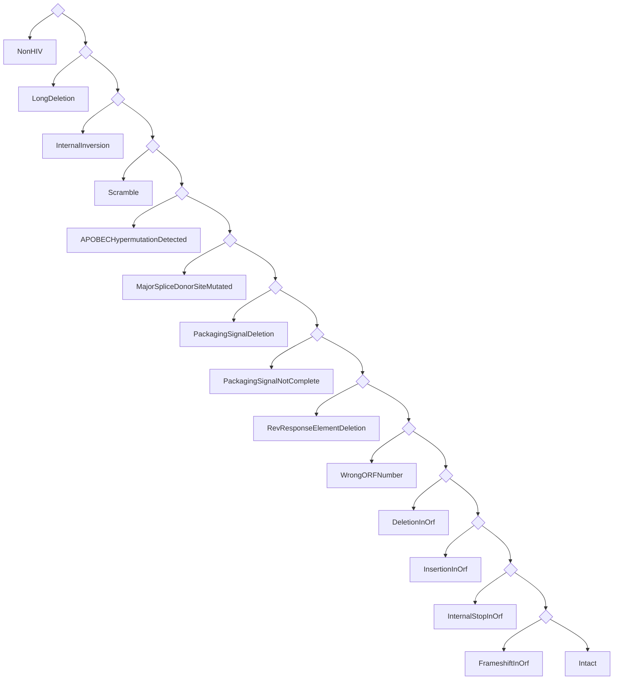

---
# You can also start simply with 'default'
theme: seriph
# random image from a curated Unsplash collection by Anthony
# like them? see https://unsplash.com/collections/94734566/slidev
background: https://cover.sli.dev
title: Proviral pipeline
# some information about your slides (markdown enabled)
info: |
  ## Proviral pipeline
  Presentation for BC CfE
class: text-center
# https://sli.dev/features/drawing
drawings:
  persist: true
# slide transition: https://sli.dev/guide/animations.html#slide-transitions
transition: fade
# enable MDC Syntax: https://sli.dev/features/mdc
mdc: true
zoom: 1.5
hideInToc: true
---

# Proviral pipeline

A gentle introduction

<!-- TODO: improve the subtitle -->

---
transition: fade-out
hideInToc: true
---

# About me

<!-- TODO: better presentation form. More detail. -->

- Programmer
  - MiCall/Proviral pipeline <!-- These are the projects that I work on mostly. -->
  - I have a blog at https://vau.place <!-- This is a programming blog. I specialize in programming languages. -->
- Ukrainian
  - Thank you Canada for support

<!-- 
TODO: add some notes here for me to read when presenting.
-->

---
hideInToc: true
zoom: 1.2
---

# Presentation plan

<Toc columns=2 />

---

# What is Proviral Pipeline?

<!-- TODO: better presentation form. More detail. -->

- Collection of programs that output images and CSV files.
- Is a pipeline. <!-- What this means is that it's a series of steps basically. -->
- Created by Don, Charlotte, and me <!-- I want to highlight the programmers' efforts. -->

<!-- 
TODO: add some notes here for me to read when presenting.
-->

---
dragPos:
  catstructure: 447,98,431,431
---

# Proviral sample workflow

<!-- TODO: better presentation form. More detail. -->

- Data collection & MiCall processing
- Proviral pipeline startup
- HIVIntact processing
- Proviral pipeline outputs
  <br><sup>(such as regions clipping and landscapes)</sup>
- BBLabTools output


<!-- 
TODO: add some notes here for me to read when presenting.
-->

---
dragPos:
  miseq: 409,44,487,487
---

# Initiation

<!-- TODO: better presentation form. More detail. -->

- Sample collection.

- Loading into MiSeq.

- Pickup by MiCall.

- MiCall initial processing.

Produces files such as <br> `conseq.csv` and `contigs.csv`.

- MiCall starts proviral pipeline.


<!-- 
TODO: add some notes here for me to read when presenting.
-->

---
dragPos:
  pipeline: 500,49,450,450
---

# Pipeline structure

<!-- TODO: better presentation form. -->

- Proviral pipeline loads data.

From files generated by MiCall, specifically
<br> `conseq.csv`, `contigs.csv`, and `cascade.csv`.

- Proviral pipeline runs QC (quality checks).

- Proviral pipeline trims primers off.

- Samples that pass all checks proceed to HIVIntact.
<br><sup>HIVSeqInR is also still supported.</sup>

- Landscape data is generated.

- Final report is generated.


<!-- 
TODO: add some notes here for me to read when presenting.
-->

---
hideInToc: true
dragPos:
  checkqc: 477,36,490,490
---

### Proviral QC is a series of steps:

<br>
<br>

<AccordionQC />


---
dragPos:
  primers: 15,125,387,258
  bottom: 44,374,323,64
  left: 415,25,552,537
---

<!-- 
TODO: add some notes here for me to read when presenting.
-->

# Primer trimming

<v-drag pos="left">

The pipeline proceeds to find primers in the remaining sequences.
There are two primers: one at 5’ (forward) and one at 3’ (reverse) end.

<AccordionPrimers />

</v-drag>
<v-drag pos="bottom">

Once primers are found, they are cut off.

</v-drag>


<!--
After the initial filtering step, the pipeline proceeds to find primers in the filtered sequences. This step involves checking both ends of the sequence for the presence of forward and reverse primers.
-->

<!-- 
TODO: add some notes here for me to read when presenting.
-->

---
dragPos:
  cfeintact: 527,14,437,599
  cfeintactwebsite: 469,-26,567,646
---

# HIVIntact

- Originally HIVIntact, now evolved into CFEIntact.
- Performs automated checks for HIV-1 genome integrity.
- Identifies various genetic anomalies:
  - Large deletions
  - Hypermutations
  - Scrambles
  - ...
- Generates reports for regions, defects, <br> and various holistic properties.
- Details at https://cfe-lab.github.io/CFEIntact

<v-drag pos="cfeintactwebsite">
<iframe src="https://cfe-lab.github.io/CFEIntact/" style="transform: scale(0.8); margins: 1px; width: 100%; height: 100%; border: 2px solid green; overflow: auto;"></iframe>
</v-drag>

<!--  -->

<!--
1. **Introduction**:
   CFEIntact is an essential part of the proviral pipeline. It started as a fork of HIVIntact and has evolved significantly since, to the point where the original publication was no longer correct for our version of HIVIntact.
2. **Key Functionality**:
   What CFEIntact does is provide an automated check for the integrity of HIV-1 genomes.
3. **Main Anomalies Detected**:
   We look for defects that can severely impact genome functionality. Hypermutations, are one example. But there are many possible kinds of them, and each defect type requires a custom algorithm to detect. So I can talk a lot about CFEIntact, but it's best to just check out the documentation, it's quite detailed.
4. **Output Files**:
   For every sample, CFEIntact generates detailed reports in CSV format—capturing defects, regions, and other relevant data.
5. **Limitations**:
   TODO: mention that in such matter as defect detection there can not be an synthetic algorith that is always correct. Furthermore, researchers are justified to override CFEIntact's decisions based on their domain expertise.
-->

---

# Back to Proviral Pipeline

<!-- TODO: better presentation form. More detail. -->

- Analyzes CFEIntact's outputs.
- Decides what single error to report.
- Slices the input sequence into its parts.
- Generates `landscapes.csv`


<!-- 
TODO: add some notes here for me to read when presenting.
-->

---

# Region extraction in Proviral Pipeline

- Aligns sequences to the **HXB2 reference genome**.
- Extracts key **HIV regions**: *gag*, *pol*, *env*, *psi_sl1*, *gp120*, *ltr3*, etc.
- Handles **inversions** and **defective regions**.
- Outputs raw sequences to `table_precursor.csv`.


<!--

Now few words about how the pipeline extracts genomic regions from the sequences.

- The first step is **aligning the input sequences** to the well-known **HXB2 reference genome**. For this, the pipeline uses blast and minimap2.
 
- Once aligned, the pipeline extracts key **HIV regions** like *gag*, *pol*, and *env*. But also some smaller, non-coding regions such as *psi_sl1,2,3* and *ltr3*.
 
- During this process, the pipeline is also looking for **inversions** and **defective regions**. If any region is inverted or missing key parts, it gets logged to standard error.
 
- All this information is then included into the final output file called `table_precursor.csv`.

-->

---
dragPos:
  landscapes: 492,1,482,522
---

# Pipeline's final verdict

<div></div>

- Proviral pipeline receives a _list of defects_ from **CFEIntact**.

- It tries to determine the most severe defect, <br>which becomes the pipeline's verdict.

- This procedure is described by the decision tree 👉

<v-drag pos="landscapes">



</v-drag>

<!--
TODO: improve these notes.

The decision tree is really a list.
-->

---
transition: fade
dragPos:
  bblabs: 160,151,675,399
---

# BBLabTools

- Useful tools for HIV research from the Brockman and Brumme Lab at SFU.


<!--

- BBLabTools is a website that hosts various research tools.

- It was written by SFU and CFE staff.

- The website is hosted on our internal network, the link is here on the slide.

-->

---
hideInToc: true
dragPos:
  landscapes: 566,6,349,548
  defecttype: 94,180,470,365
---

# BBLabTools

- Draws landscape plots (dev version).

- There is a translation step involved:

<v-drag pos="defecttype">
```python {*}{maxHeight: '100%'}
DEFECT_TYPE = {'LargeDeletion': 'Large Deletion',
               'LongDeletion': 'Large Deletion',
               'InternalInversion': 'Inversion',
               'ScramblePlus': 'Scrambled',
               'ScrambleMinus': 'Scrambled',
               'ScrambleCheck': 'Scrambled',
               'Scramble': 'Scrambled',
               'Hypermut': 'Hypermutated',
               'APOBECHypermutation': 'Hypermutated',
               'Intact': 'Intact',
               'Inferred_Intact': 'Intact',
               'PrematureStop_OR_AAtooLong_OR_AAtooShort': 'Premature Stop',
               'PrematureStop_OR_AAtooLong_OR_AAtooShort_GagNoATG': 'Premature Stop',
               'Inferred_PrematureStopORInframeDEL': 'Premature Stop',
               'Inferred_PrematureStopORInframeDEL_GagNoATGandFailed': 'Premature Stop',
               'Inferred_PrematureStopORInframeDEL_GagNoATG': 'Premature Stop',
               'InternalStop': "Premature Stop",
               'MutatedStopCodon': "Premature Stop",
               'MutatedStartCodon': "Premature Stop",
               'SequenceDivergence': "Divergence",
               'Deletion': "Premature Stop",
               'Insertion': "Large Insertion",
               'Frameshift': "Frameshift",
               '5DEFECT': "5' Defect",
               '5DFECT_IntoGag': "5' Defect",  # this is a typo in HIVSeqinR
               '5DEFECT_GagNoATGGagPassed': "5' Defect",
               '5DEFECT_GagNoATGGagFailed': "5' Defect",
               'Inferred_Intact_GagNoATG': "5' Defect",
               'Inferred_Intact_NoGag': "5' Defect",
               'Intact_GagNoATG': "5' Defect",
               'MajorSpliceDonorSiteMutated': "5' Defect",
               'PackagingSignalDeletion': "5' Defect",
               'PackagingSignalNotComplete': "5' Defect",
               'RevResponseElementDeletion': "5' Defect",
               'NonHIV': 'Chimera',
               'AlignmentFailed': 'Chimera',
               'UnknownNucleotide': 'Chimera',
               }
```
</v-drag>


<!--

We use development version of BBLabs to draw landscape plots.
Eventually this version will be released, and everybody will be able to make them marvelous drawings!

Before the plots are generated, a translation step converts the defect types into categories that BBLabTools can represent graphically. Currently, BBLabTools is in a development phase, but it will be officially released in the upcoming version of our software. 

This plotter supports both CFEIntact and HIVSeqInR, but the translation is not ideal. For instance it translates <b>MutatedStopCodon</b> into <b>PrematureStop</b>.

-->

---

# Summary of output files

<br>

<AccordionOutputsSummary />

<!-- 

TODO: improve these notes.

The list is in the order of importance.
During presentation I will pick the first item, and talk about it.
Then I will just mention the rest briefly.

-->

---
transition: slide-up
---

# Future plans

<!-- TODO: better presentation form. More detail. -->

- BBLabTools release.
- Better support for subtypes in CFEIntact.
- More regions recognition in CFEIntact.
- Better output description in CFEIntact.


<!--
TODO: improve these notes.

- BBLabTools will be released soon, with the landscape plots support.

- CFEIntact is currently not doing well with subtypes other than B, we want to fix that.

- It would be nice to output more regions information in CFEIntact, such as the various PSI locations.

- We want to give CFEIntact a notion of "confidence" and "severity", with which every defect can be labelled. 
  This can help researchers decide if they need to take a closer look.
  A natural example is the hypermutation check, which outputs probability that a given sequence was hypermutated.
  That is our confidence.
-->

---
layout: cover
background: https://cover.sli.dev
zoom: 2.0
hideInToc: true
---

# Thank you
