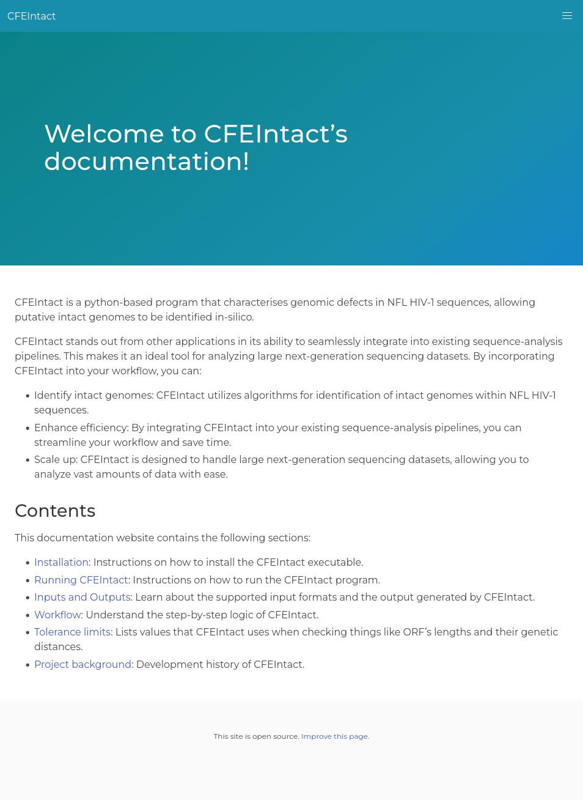
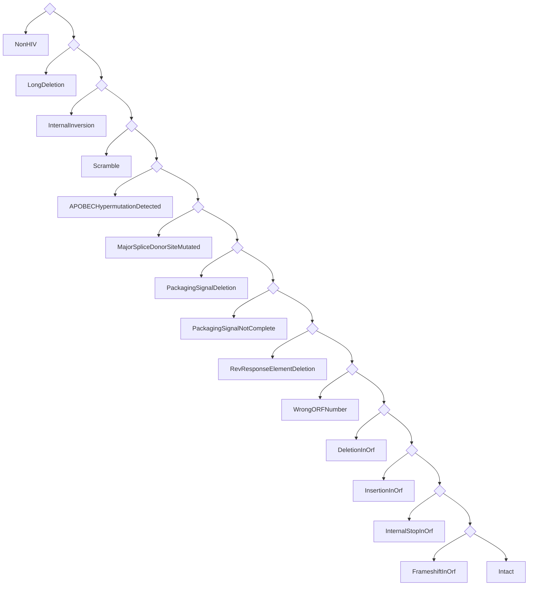
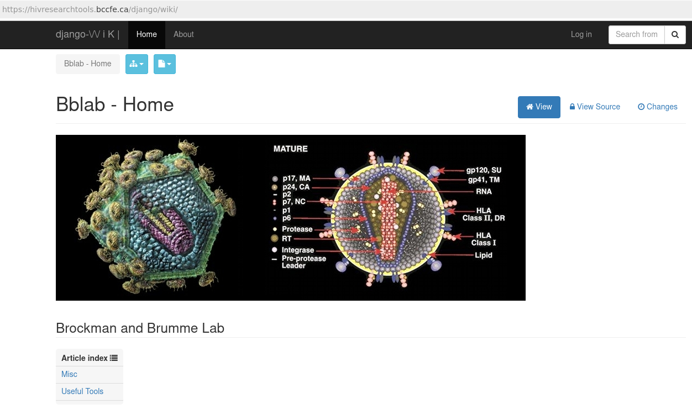
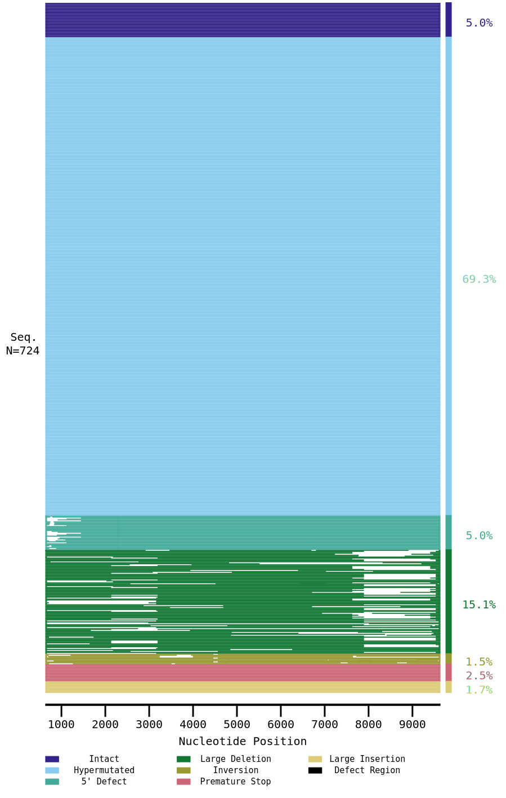

---
# You can also start simply with 'default'
theme: seriph
# random image from a curated Unsplash collection by Anthony
# like them? see https://unsplash.com/collections/94734566/slidev
background: https://cover.sli.dev
# some information about your slides (markdown enabled)
title: Welcome to Slidev
info: |
  ## Slidev Starter Template
  Presentation slides for developers.

  Learn more at [Sli.dev](https://sli.dev)
# apply unocss classes to the current slide
class: text-center
# https://sli.dev/features/drawing
drawings:
  persist: false
# slide transition: https://sli.dev/guide/animations.html#slide-transitions
transition: slide-left
# enable MDC Syntax: https://sli.dev/features/mdc
mdc: true
zoom: 1.5
---

<!-- Structure and interpretation of the -->

# Proviral pipeline

A gentle introduction

<!-- TODO: improve the subtitle -->

---
transition: fade-out
---

# About me

<!-- TODO: better presentation form. More detail. -->

- Programmer
  - MiCall/Proviral pipeline <!-- These are the projects that I work on mostly. -->
  - I have a blog at https://vau.place <!-- This is a programming blog. I specialize in programming languages. -->
- Ukrainian
  - Thank you Canada for support

---

# Presentation plan

<Toc columns=2 />

---

# About Proviral Pipeline

<!-- TODO: better presentation form. More detail. -->

- Collection of programs that output images and CSV files.
- Is a pipeline. <!-- What this means is that it's a series of steps basically. -->
- Created by Don, Charlotte, and me <!-- I want to highlight the programmers' efforts. -->

---
dragPos:
  catstructure: 447,98,431,431
---

# Proviral sample workflow

<!-- TODO: better presentation form. More detail. -->

- Data collection & MiCall processing
- Proviral pipeline startup
- HIVIntact processing
- Proviral pipeline outputs
  <br><sup>(such as regions clipping and landscapes)</sup>
- BBLabTools output


---
dragPos:
  miseq: 409,44,487,487
---

# Initiation

<!-- TODO: better presentation form. More detail. -->

- Sample collection.

<!-- <Accordion1 /> -->

- Loading into MiSeq.

- Pickup by MiCall.

- MiCall initial processing.

Produces files such as <br> `conseq.csv` and `contigs.csv`.

- MiCall starts proviral pipeline.

<!-- <br> -->

<!-- MiCall also downloads <br> Proviral results when available. -->


---
dragPos:
  pipeline: 500,49,450,450
---

# Pipeline structure

<!-- TODO: better presentation form. More detail. -->

- Proviral pipeline loads data.

From files generated by MiCall, specifically
<br> `conseq.csv`, `contigs.csv`, and `cascade.csv`.

- Proviral pipeline runs QC (quality checks).

- Proviral pipeline trims primers off.

- Samples that pass all checks proceed to HIVIntact.
<br><sup>HIVSeqInR is also still supported.</sup>

- Landscape data is generated.

- Final report is generated.


---
hideInToc: true
dragPos:
  checkqc: 477,36,490,490
---

### Proviral QC is a series of steps:

<br>
<br>

<AccordionQC />


---
dragPos:
  primers: 15,125,387,258
  bottom: 44,374,323,64
  left: 415,25,552,537
---

# Primer trimming

<v-drag pos="left">

The pipeline proceeds to find primers in the remaining sequences.
There are two primers: one at 5’ (forward) and one at 3’ (reverse) end.

<AccordionPrimers />

</v-drag>
<v-drag pos="bottom">

Once primers are found, they are cut off.

</v-drag>


<!--
After the initial filtering step, the pipeline proceeds to find primers in the filtered sequences. This step involves checking both ends of the sequence for the presence of forward and reverse primers.
-->

---
dragPos:
  cfeintact: 527,14,437,599
---

# HIVIntact

- Originally HIVIntact, now evolved into CFEIntact.
- Performs automated checks for HIV-1 genome integrity.
- Identifies various genetic anomalies:
  - Large deletions
  - Hypermutations
  - Scrambles
  - ...
- Generates reports for regions, defects, <br> and various holistic properties.
- Details at https://cfe-lab.github.io/CFEIntact ----------->



<!--
1. **Introduction**:
   CFEIntact is an essential part of the proviral pipeline. It started as a fork of HIVIntact and has evolved significantly since, to the point where the original publication was no longer correct for our version of HIVIntact.
2. **Key Functionality**:
   What CFEIntact does is provide an automated check for the integrity of HIV-1 genomes.
3. **Main Anomalies Detected**:
   We look for defects that can severely impact genome functionality. Hypermutations, are one example. But there are many possible kinds of them, and each defect type requires a custom algorithm to detect. So I can talk a lot about CFEIntact, but it's best to just check out the documentation, it's quite detailed.
4. **Output Files**:
   For every sample, CFEIntact generates detailed reports in CSV format—capturing defects, regions, and other relevant data.
5. **Limitations**:
   TODO: mention that in such matter as defect detection there can not be an synthetic algorith that is always correct. Furthermore, researchers are justified to override CFEIntact's decisions based on their domain expertise.
-->

---

# Back to Proviral Pipeline

<!-- TODO: better presentation form. More detail. -->

- Analyzes CFEIntact's outputs.
- Decides what single error to report.
- Slices the input sequence into its parts.
- Generates `landscapes.csv`


---

# Region extraction in Proviral Pipeline

- Aligns sequences to the **HXB2 reference genome**.
- Extracts key **HIV regions**: *gag*, *pol*, *env*, *psi_sl1*, *gp120*, *ltr3*, etc.
- Handles **inversions** and **defective regions**.
- Outputs raw sequences to `table_precursor.csv`.

<!-- specifically `x1,psi_sl1,psi_sl2,psi_sl3,psi_sl4,gag,pol,protease,rt,integrase,vif,vpr,tat_exon1,rev_exon1,d4,x2,vpu,env,gp120,gp41,tat_exon2,rev_exon2,x3,nef,ltr3` -->


<!--

Now few words about how the pipeline extracts genomic regions from the sequences.

- The first step is **aligning the input sequences** to the well-known **HXB2 reference genome**. For this, the pipeline uses blast and minimap2.
 
- Once aligned, the pipeline extracts key **HIV regions** like *gag*, *pol*, and *env*. But also some smaller, non-coding regions such as *psi_sl1,2,3* and *ltr3*.
 
- During this process, the pipeline is also looking for **inversions** and **defective regions**. If any region is inverted or missing key parts, it gets logged to standard error.
 
- All this information is then included into the final output file called `table_precursor.csv`.

-->

---
dragPos:
  landscapes: 492,1,482,522
---

# Pipeline's final verdict

<div></div>

- Proviral pipeline receives a _list of defects_ from **CFEIntact**.

- It tries to determine the most severe defect, <br>which becomes the pipeline's verdict.

- This procedure is described by the decision tree 👉

<v-drag pos="landscapes">



</v-drag>

<!--
TODO: improve these notes.

The decision tree is really a list.
-->

---
transition: fade
dragPos:
  bblabs: 160,151,675,399
---

# BBLabTools

- Useful tools for HIV research from the Brockman and Brumme Lab at SFU.



<!--
TODO: say something about the website.

Here is part of website's contents (TODO: distill it into something I can say):

Useful tools for HIV research from the Brockman and Brumme Lab at SFU

These tools can be accessed at the BBLab-Wiki.

See bblab_inventory for implementation details.

See server_config for some notes on accessing and updating the server.

See tests/README for a guide to testing each tool.

Layout Generators

    Sequencing layout designer
    Sequencing plate layout archive (You need an account to access this page)

    Guava layout designer
    Guava plate layout archive (You need an account to access this page)

QC and data processing

    Fasta Converter in house fasta-csv conversion tool
    Text to columns Text to Columns tool
    False discovery rate q-value calculator

HIV sequence/function analyses

    HXB2 Genome genome map
    DNA translator DNA translation tool
    Quality Checker Quality Check Tool
    Unique Sequence Finder USF
    Variable Function Analysis in house variable-function analyzer
    Codon by codon in house analysis tool
    Phylogenetic Dating

HLA interpretation and analyses

    HLA class I sequence-based typing interpretation tool
    PHAGE-I-expanded - Proportion of HLA Associated Genomic Escape (individual). PHAGE-I-expanded

TCR interpretation and analysis

    TCR Distance convert cellranger output for TCR Visualizer
    TCR Visualizer network diagram visualization

Other useful resources

    Primer tables for sequencing or PCR
    Papers about HIV virology, epidemiology, immunology
    Stanford Drug Resistance Database: https://hivdb.stanford.edu/
    LANL HIV Sequence database: https://www.hiv.lanl.gov/content/sequence/HIV/mainpage.html/
    LANL HIV Immunology Database: https://www.hiv.lanl.gov/content/immunology/index.html/

Testing Instructions

The following outlines testing protocols for each active tool in the wiki. These tests are not comprehensive, but represent the typical input/output done by most of the researchers which use these tools. Test data supplied by the CfE research team.
Sequencing layout designer

See sequencing_layout/Sequencing_Layout_template.xlsx for an example of data to be used with this tool. Copy the Sample ID column (8 rows) into the leftmost text box and the Primer column (8 rows) into the middle text box.

Complete the User Information fields, using some <your_test> identifier for Plate ID. Then press Populate, followed by Update FROM table. Leave Horizontal selected in Layout Parameters. Then press Submit. You should recieve an email with two files: <your_test>.plt and <your_test>.html.

The output file data should match sequencing_layout/sequencing_output.plt and sequencing_layout/sequencing_output.html.
Guava layout designer

Fill the leftmost table with

ctrl1
ctrl2
ctrl3
ctrl4
ctrl5
ctrl6
ctrl7
ctrl8

And the center table with

samp1
samp2
samp3
samp4
samp5
samp6
samp7
samp8

Instructions will be in the rightmost table. Using default settings, with ExperimentID=<your_test>, press Populate, followed by Update FROM table. Then press Submit. You should recieve an email with two files: <your_test>.csv and <your_test>.html.

The output file data should match guava_layout/guava_output.csv and guava_layout/guava_output.html.
Fasta Converter

Upload or copy-and-paste the test.fasta file, and you should get a CSV file that matches fasta_converter/converted.csv.

NOTE: the CSV-to-Fasta conversion currently has an issue, which is open in this repo.
Text-to-Columns

Copy-and-paste the contents of text_to_columns/ttc_input.csv, and you should be able to download a file which matches text_to_columns/ttc_output.csv.

NOTE: there is an issue in the current version - if each row in the input file is not the same length the result will be a 500 Server Error message. This is fixed in the test branch, as seen here: #2
False discovery q-value

This tool does not need a test input file. By default, the following values are populated in the text field:

0.51
0.01
0.12
0.16
0.92
0.16
0.01
0.51
0.62

The output file is located in qvalue/q-values_output.xlsx
HXB2 Genome map

No testing should be needed. The page will load, or it won't. The contents shouldn't change.

A copy of the HTML page is located in HIV_genome/HIV-I HXB2 Genome.html.
DNA translator

Copy-and-paste the input file translate_DNA/test_translate_DNA.fasta into the text field, with the default settings, and you should get the output found in translate_DNA/test_translate_DNA_output.txt.
Quality Check

The test.fasta file, with all analysis entries checked (default), should produce an output file which matches quality_check/quality_check_data_test.xlsx.
Unique Sequence Finder

The test.fasta file should produce an output file identical to unique_sequence/unique_sequence_data_noduplicate.csv.

The unique_sequence/test_duplicate.fasta file should match unique_sequence/unique_sequence_data_duplicate.csv.
Variable function analyzer - doesn't need test data, but save output file

This tool does not need test input data. To test, the following values in the page text should be copied into the text input field:

A02:26	A03:01:01G	B07:02:01G	B40:01:01G	C03:04:01G	C07:02:01G	0.3
A01:01:01G	A02:01:01G	B08:01:01G	B15:01:01G	C03:04:01G	C07:01:01G	0.7
A01:01:01G	A02:01:01G	B08:01:01G	B57:01:01G	C06:02:01G	C07:01:01G	0.8
A02:01:01G	A03:01:01G	B14:02:01	B15:34	C03:04:01G	C08:02:01	0.3
A02:01:01G	A24:03:01G	B38:01:01	B51:01:01G	C12:03:01G	C14:02:01	0.45
A02:01:01G	A02:01:01G	B14:02:01	B40:01:01G	C03:04:01G	C08:02:01	0.3
A01:01:01G	A01:01:01G	B08:01:01G	B57:01:01G	C06:02:01G	C07:01:01G	0.75
A11:01:01G	A23:01:01G	B07:02:01G	B51:01:01G	C04:01:01G	C15:02:01G	0.2
A01:01:01G	A03:01:01G	B27:05:02G	B57:01:01G	C01:02:01G	C06:02:01G	0.8
A01:01:01G	A02:01:01G	B08:01:01G	B44:02:01G	C02:02:02G	C07:01:01G	0.7
A01:01:01G	A11:01:01G	B08:01:01G	B35:01:01G	C04:01:01G	C07:64	0.9
A02:01:01G	A24:02:01G	B15:01:01G	B15:07:01G	C01:02:01G	C03:03:01G	0.4
A01:01:01G	A25:01:01G	B08:01:01G	B39:01:01G	C07:01:01G	C12:03:01G	0.6

The output file is located in variable_function/variable_function_output.csv
Codon-by-Codon

This tool does not need a test input file. By default, the following values are populated in the text field:

0.786	MGGKWSKRNVVEWPTVRERMRRAEPAADGVGAVSRDLEKHGAITSSNTATNNAACAWLEAQEEEEVGFPVRPQVPLRPMTYRAAVDLSHFLKEKGGLGGLIHSQKRQDILDLWVYHTQGYFPDWQNYTPGPGIRYPLCFGWCFKLVPVEPDKVEEANEGENNSLLHPMSLHGMEDPEGEVLMWKFDSRLAFHHMARELHPEYYKDC
0.982	MGGKWSKSSMVGWPKVRERMRRAEPAADGVGAVSRDLEKHGAITSSNTAANNAACAWLEAQEDEEVGFPVRPQVPLRPMTYKAAIDLSHFLKEKGGLEGLIYSQKRQDILDLWVYHTQGFFPDWQNYTPGPGVRYPLTFGWCFKLVPVDPEKVEEANEGENNSLLHPMSLHGMEDTEKEVLAWRFDSLLAFRHMAREVHPEYYKDC
1.021	MGSKWSKSSVVGWPDVRERMRRAEPAADGVGAVSRDLERHGAITSGNTATNNADCAWLEAQEDEEVGFPVRPQVPLRPMTHRAAMDLSHFLRDKGGLDGLIWSQKRQDILDLWVYHTQGFFPDWQNYTPGPGTRFPLTFGWCFKLVPVELEKVEEANEGENNSLLHPMSQHGMEDPEKEVLAWRFDSRLAFQHMARELHPEYYKDC
0.214	MGGKWSKCSTPGWSTIRERMRRAEPAADGVGPASRDLEKHGALTSSNTAANNAACAWLEAQEEEEVGFPVRPQVPLRPMTYKGALDLSHFLNEKGGLEGLIYSQKRQDILDLWVYNTQGFFPDWQNYTPGPGVRYPLCFGWCFKLVPVESEKVEEATEGENNSLLHPVCLHGMDDPEGEVLVWKFDSKLAFHHMAREMHPEYYKNC
0.467	MGGKWSKCSMGGWPSVRERMRRTEPAAEGVGAASRDLERHGALTSNNTPTNNAACAWLEAQEEEEVGFPVRPQVPLRPMTYKGALDLSHFLKEKGGLEGLVYSQKRQDILDLWVFNTQGFFPDWQGYTPGPGIRYPLTFGWCFKLVPMEPDKVEEANEGENNSLLHPVSLHGMEDPEREVLVWRFDSRLAFRHVAQELHPEYYKNR
0.801	MGGKWSKLS--GWHTIRERMRRAEPAADGVGATSRDLERHGAVTSSNTATNNGACARPEAQENDEVGFPVRPQVPLRPMTFKAAFDLSHFLKEKGGLDGLVYSQKRQEILDLWVYHTQGYLPDWQNYTPGPGTRYPLCFGWCFKLVPMEQEKVEEANEGENNRLLHPISQHGMEDPEREVLVWKFDSSLAFHHRARELHPEFYKDC

The output should match the data in codon_by_codon/test_codon_by_codon.xlsx.
Phylodating

Testing instructions for this tool are thoroughly described on the Phylodating page.
HLA Class(ification Tool)

Use test.fasta for this tool, in Batch Mode, with HLA Locus: C.

The results should match hla_class/HLA-C batch mode test data OUTPUT.csv.

If you select HLA Locus: A or B, you should get an error message about invalid sequences (or if in Single Sequence Mode, about the length of the sequences.)
PHAGE-I-Expanded

This tool does not need a test input file. Press Load Sample and select Gag as Protein of Interest.

The output TSV (tab separated values) file should match phage_i_expanded/phage_i_expanded_results_gag_test.tsv.
TCR Distance

There are two formats of input data, one is a "clones" file in TSV (tab separated values) format. The other is a pair of "annotations" files: consensus annotations, and filtered contig annotations. Both types are contained in subdirectories of tcr_distance/. Make sure to select human, not mouse.

These inputs should produce .dist files which match the output files in the corresponding subdirectories.
TCR Visualizer

The .dist files from the TCR Distance tool should be loadable in the TCR visualizer, and produce a network diagram. The number of edges can be altered by the Edge distance limit field, and the Sample report will tell you how many connected nodes are in the diagram.

There is no rigorous output file for testing, since this is a visualization sandbox tool.
-->

---
dragPos:
  landscapes: 566,6,349,548
  defecttype: 94,180,470,365
---

# BBLabTools

- Draws landscape plots (dev version).

- There is a translation step involved:

<v-drag pos="defecttype">
```python {*}{maxHeight: '100%'}
DEFECT_TYPE = {'LargeDeletion': 'Large Deletion',
               'LongDeletion': 'Large Deletion',
               'InternalInversion': 'Inversion',
               'ScramblePlus': 'Scrambled',
               'ScrambleMinus': 'Scrambled',
               'ScrambleCheck': 'Scrambled',
               'Scramble': 'Scrambled',
               'Hypermut': 'Hypermutated',
               'APOBECHypermutation': 'Hypermutated',
               'Intact': 'Intact',
               'Inferred_Intact': 'Intact',
               'PrematureStop_OR_AAtooLong_OR_AAtooShort': 'Premature Stop',
               'PrematureStop_OR_AAtooLong_OR_AAtooShort_GagNoATG': 'Premature Stop',
               'Inferred_PrematureStopORInframeDEL': 'Premature Stop',
               'Inferred_PrematureStopORInframeDEL_GagNoATGandFailed': 'Premature Stop',
               'Inferred_PrematureStopORInframeDEL_GagNoATG': 'Premature Stop',
               'InternalStop': "Premature Stop",
               'MutatedStopCodon': "Premature Stop",
               'MutatedStartCodon': "Premature Stop",
               'SequenceDivergence': "Divergence",
               'Deletion': "Premature Stop",
               'Insertion': "Large Insertion",
               'Frameshift': "Frameshift",
               '5DEFECT': "5' Defect",
               '5DFECT_IntoGag': "5' Defect",  # this is a typo in HIVSeqinR
               '5DEFECT_GagNoATGGagPassed': "5' Defect",
               '5DEFECT_GagNoATGGagFailed': "5' Defect",
               'Inferred_Intact_GagNoATG': "5' Defect",
               'Inferred_Intact_NoGag': "5' Defect",
               'Intact_GagNoATG': "5' Defect",
               'MajorSpliceDonorSiteMutated': "5' Defect",
               'PackagingSignalDeletion': "5' Defect",
               'PackagingSignalNotComplete': "5' Defect",
               'RevResponseElementDeletion': "5' Defect",
               'NonHIV': 'Chimera',
               'AlignmentFailed': 'Chimera',
               'UnknownNucleotide': 'Chimera',
               }
```
</v-drag>



<!--
TODO: improve these slide notes.

We use development version of BBLabs to print landscape plots.
Eventually this version will be released, and everybody will be able to make them marvelous drawings!

TODO: discuss the matter of translating CFEIntact's defects into the categories used by the landscape plotter. At least say that (1) it supports both CFEIntact and HIVSeqInR defect names, (2) it is often not ideal.
-->

---

# Summary of output files

<!-- TODO: better presentation form. More detail. -->

| File | Description |
| ---- | ----------- |
| `defects.csv` | Detailed description of every defect detected by CFEIntact. <a href="https://github.com/cfe-lab/CFEIntact/blob/master/tests/expected-results-small-csv/defects.csv" target="_blank">Example.</a> |
| `landscapes.csv` | Data used to plot the defect landscapes on BBLabTools. <a href="https://gist.github.com/Donaim/3371ccb218270be00af466beb771a4ab" target="_blank">Example.</a> |
| `landscapes.svg` | Landscape plot of sequences' defects. <a href="https://raw.githubusercontent.com/gist/Donaim/aa2b1919ff521ab30b47c09924c365e9/raw/77bcdec7fb3fb1bab4879c72886dbd154b7e011a/landscape.svg" target="_blank">Example.</a> |
| `regions.csv` | Landscape plot of sequences' defects. <a href="https://raw.githubusercontent.com/gist/Donaim/aa2b1919ff521ab30b47c09924c365e9/raw/77bcdec7fb3fb1bab4879c72886dbd154b7e011a/landscape.svg" target="_blank">Example.</a> |


- `regions.csv`
- `outcome_summary.csv`
- `table_precursor.csv`

<!-- In the order of importance: -->

---

# Where to find what

<!-- TODO: better presentation form. More detail. -->

- `defects.csv`
- `landscapes.svg` (on-demand)
- `landscapes.csv`
- `regions.csv`
- `outcome_summary.csv`
- `table_precursor.csv`

---

# Future plans

<!-- TODO: better presentation form. More detail. -->

- BBLabTools release.
- Better support for subtypes in CFEIntact.
- More regions recognition in CFEIntact.
- Better output description in CFEIntact.
