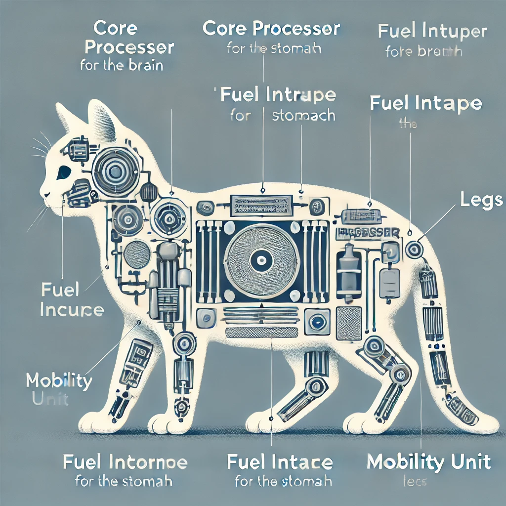
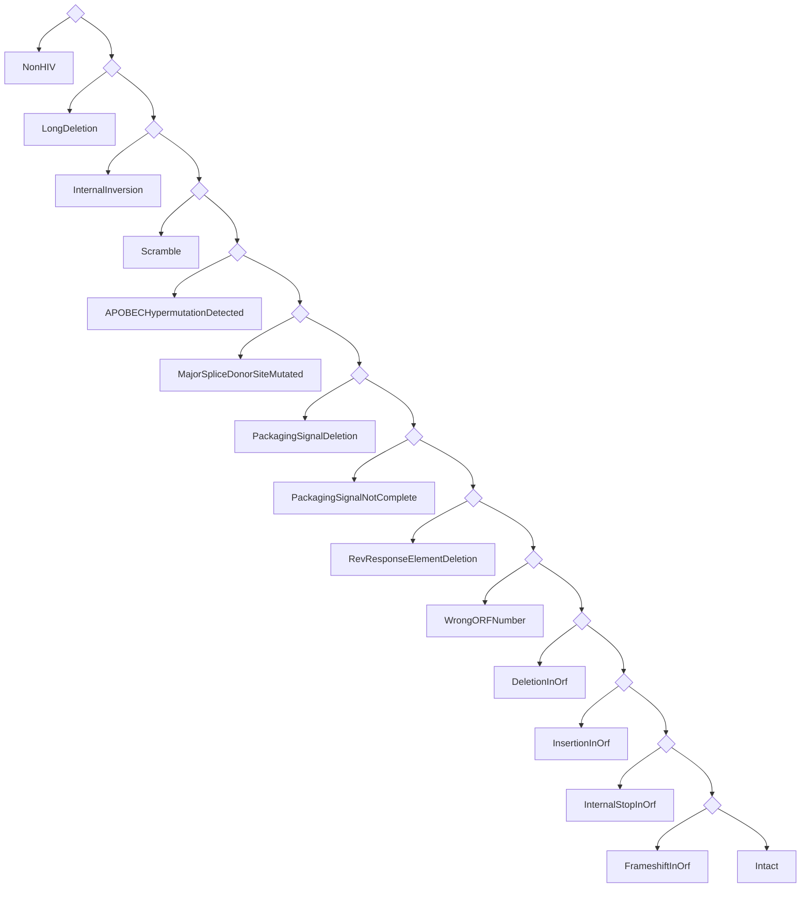

---
# You can also start simply with 'default'
theme: seriph
# random image from a curated Unsplash collection by Anthony
# like them? see https://unsplash.com/collections/94734566/slidev
background: https://cover.sli.dev
# some information about your slides (markdown enabled)
title: Welcome to Slidev
info: |
  ## Slidev Starter Template
  Presentation slides for developers.

  Learn more at [Sli.dev](https://sli.dev)
# apply unocss classes to the current slide
class: text-center
# https://sli.dev/features/drawing
drawings:
  persist: false
# slide transition: https://sli.dev/guide/animations.html#slide-transitions
transition: slide-left
# enable MDC Syntax: https://sli.dev/features/mdc
mdc: true
---

<!-- Structure and interpretation of the -->

# Proviral pipeline

A gentle introduction

<!-- TODO: improve the subtitle -->

---
transition: fade-out
---

# About me

<!-- TODO: better presentation form. More detail. -->

- Programmer
  - MiCall/Proviral pipeline
  - I have a blog at https://vau.place
- Ukrainian
  - Thank you Canada for support
<!-- - TODO: more points -->

---

# Presentation plan

<Toc columns=2 />

---

# About Proviral Pipeline

<!-- TODO: better presentation form. More detail. -->

- Collection of programs that output images and CSV files.
- Is a pipeline.
- Created by Don, Charlotte, and me

---
dragPos:
  catstructure: 459,90,443,443
---

# Structure of Proviral Pipeline

<!-- TODO: better presentation form. More detail. -->

- Sample collection & MiCall processing
- Proviral pipeline startup
- HIVIntact processing
- Proviral pipeline outputs
   (such as regions clipping and landscapes)
- BBLabTools output

---
dragPos:
  miseq: 606,41,328,328
---

# Initiation

<!-- TODO: better presentation form. More detail. -->

First, the samples are collected.

<!-- <Accordion1 /> -->

Then they are loaded into MiCall.

MiCall processes the samples and starts Proviral pipeline via Kive.

---

# Proviral startup

<!-- TODO: better presentation form. More detail. -->

- Proviral pipeline runs QC (quality checks) on every sequence.

- It uses blast, mafft, and mappy for alignment purposes.

- Samples that passed QC proceed to CFEIntact analysis.

---
hideInToc: true
dragPos:
  checkqc: 477,36,490,490
---

### Proviral QC is a series of steps:

 
 

<AccordionQC />

---

# HIVIntact

<!-- TODO: better presentation form. More detail. -->

Now called CFEIntact.

---
dragPos:
  landscapes: 524,-8,496,493
---

# Back to Proviral Pipeline

<!-- TODO: better presentation form. More detail. -->

- Decides what single error to report (TODO: the decision tree)
- Slices the input sequence into its parts, specifically `x1,psi_sl1,psi_sl2,psi_sl3,psi_sl4,gag,pol,protease,rt,integrase,vif,vpr,tat_exon1,rev_exon1,d4,x2,vpu,env,gp120,gp41,tat_exon2,rev_exon2,x3,nef,ltr3`
- Generates `landscapes.csv`

<Transform :scale="0.3">

</Transform>

---
dragPos:
  bblabs: 123,122,725,429
transition: fade
---

# BBLabTools

<!-- TODO: better presentation form. More detail. -->

- Useful tools for HIV research from the Brockman and Brumme Lab at SFU.

---
dragPos:
  landscapes: 387,1,555,555
---

# BBLabTools

- Paints landscape plots (at some point).

---

# Summary of output files

<!-- TODO: better presentation form. More detail. -->

- `defects.csv`
- `landscapes.svg` (on-demand)
- `landscapes.csv`
- `regions.csv`
- `outcome_summary.csv`
- `table_precursor.csv`

<!-- In the order of importance: -->

---

# Where to find what

<!-- TODO: better presentation form. More detail. -->

- `defects.csv`
- `landscapes.svg` (on-demand)
- `landscapes.csv`
- `regions.csv`
- `outcome_summary.csv`
- `table_precursor.csv`

---

# Future plans

<!-- TODO: better presentation form. More detail. -->

- BBLabTools release.
- Better support for subtypes in CFEIntact.
- More regions recognition in CFEIntact.
- Better output description in CFEIntact.
